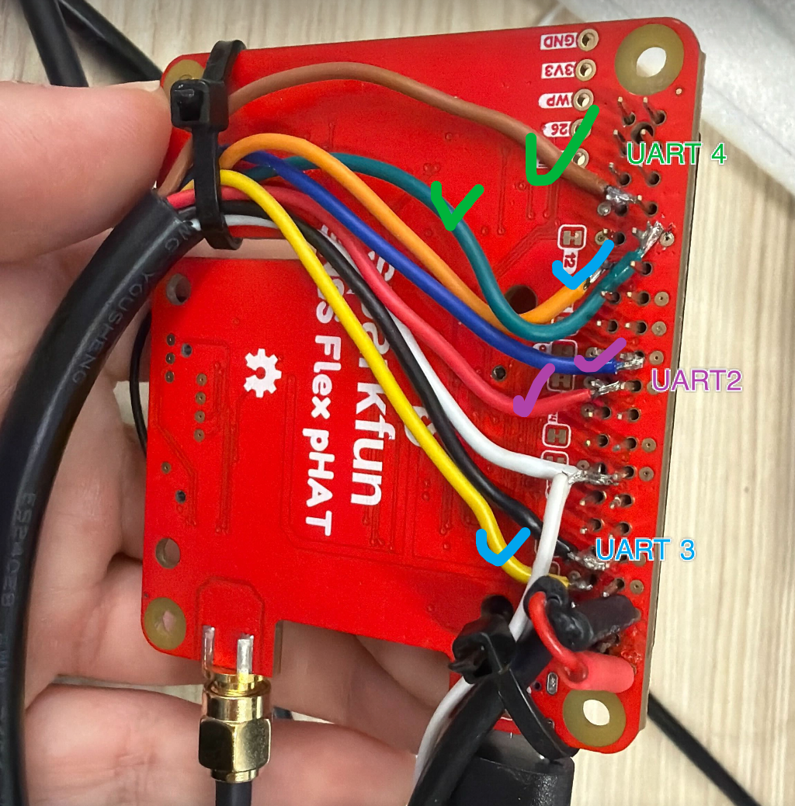

# Save Raw GNSS and IMU Data

Final scripts are in `src/gnss_imu`.

There are three UARTs using adapters to connect with the Jetson: SparkFUN's UART2, UART3, UART4.
- UART2 is for the GNSS raw data output.
- UART3 is for the IMU raw data output.

Find which physical USB port each one is using. (See more details in the fig.）



**Steps:**
1. Change the temporal port name to a consistent name.
2. For GNSS:
   - a. Use the USB of the SparkFUN to connect with the miniPC (Windows) to set the configuration of UART2.
   - b. Run the script to save the output.
3. For IMU:
   - a. Set configuration.
   - b. Save as rosbag.

---

## 1. Change the Temporal Port Name

For example, change UART2 to `/dev/gnss_raw`, change UART3 to `/dev/im19_mems`. Below is the example of `/dev/gnss_raw`.

### Check the Temporal PORT Name

```bash
ls /dev/ttyUSB* /dev/ttyACM* 2>/dev/null
```

### Identify the ID_PATH

Example: `/dev/ttyUSB2`

```bash
udevadm info -q property -n /dev/ttyUSB2 | grep ID_PATH
```

This will output the path of ttyUSB2, for example:

```
ID_PATH=platform-3610000.usb-usb-0:1.3:1.0
```

### Create the udev Rule

```bash
sudo nano /etc/udev/rules.d/99-usb-path-names.rules
```

Add the following line (change `ID_PATH` and the symlink name to match your device):

```im19_mems
SUBSYSTEM=="tty", ENV{ID_PATH}=="platform-3610000.usb-usb-0:1.3:1.0", SYMLINK+="gnss_raw"
SUBSYSTEM=="tty", ENV{ID_PATH}=="platform-3610000.usb-usb-0:2.2.4:1.0", SYMLINK+="gnss_raw"
SUBSYSTEM=="tty", ENV{ID_PATH}=="platform-3610000.usb-usb-0:2.2.3:1.0", SYMLINK+="im19_mems"
```

### Reload and Apply Rules

```bash
sudo udevadm control --reload-rules
sudo udevadm trigger
```

### Verify

```bash
ls -l /dev/gnss_raw
```

---

## 2. GNSS

### 2a. Device Configuration via USB

Connect the SparkFUN module to the miniPC via USB and apply the following configuration using u-center or a UBX configuration tool.

| Key Name | Layer | Value |
|---|---|---|
| CFG-UART2OUTPROT-UBX | RAM (0) | 1 |
| CFG-UART2OUTPROT-UBX | BBR (1) | 1 |
| CFG-UART2OUTPROT-UBX | FLASH (2) | 1 |
| CFG-UART2OUTPROT-RTCM3X | RAM (0) | 0 |
| CFG-UART2OUTPROT-RTCM3X | BBR (1) | 0 |
| CFG-UART2OUTPROT-RTCM3X | FLASH (2) | 0 |
| CFG-MSGOUT-UBX_RXM_SFRBX_UART2 | RAM (0) | 1 |
| CFG-MSGOUT-UBX_RXM_SFRBX_UART2 | BBR (1) | 1 |
| CFG-MSGOUT-UBX_RXM_SFRBX_UART2 | FLASH (2) | 1 |
| CFG-MSGOUT-UBX_RXM_RAWX_UART2 | RAM (0) | 1 |
| CFG-MSGOUT-UBX_RXM_RAWX_UART2 | BBR (1) | 1 |
| CFG-MSGOUT-UBX_RXM_RAWX_UART2 | FLASH (2) | 1 |
| CFG-MSGOUT-UBX_TIM_TM2_UART2 | RAM (0) | 1 |
| CFG-MSGOUT-UBX_TIM_TM2_UART2 | BBR (1) | 1 |
| CFG-MSGOUT-UBX_TIM_TM2_UART2 | FLASH (2) | 1 |
| CFG-RATE-MEAS | RAM (0) | 200 (ms, i.e. 5 Hz) |
| CFG-RATE-MEAS | BBR (1) | 200 (ms, i.e. 5 Hz) |
| CFG-RATE-MEAS | FLASH (2) | 200 (ms, i.e. 5 Hz) |
| CFG-MSGOUT-UBX_NAV_CLOCK_UART2 | RAM (0) | 1 |
| CFG-MSGOUT-UBX_NAV_CLOCK_UART2 | BBR (1) | 1 |
| CFG-MSGOUT-UBX_NAV_CLOCK_UART2 | FLASH (2) | 1 |
| CFG-MSGOUT-UBX_NAV_POSLLH_UART2 | RAM (0) | 1 |
| CFG-MSGOUT-UBX_NAV_POSLLH_UART2 | BBR (1) | 1 |
| CFG-MSGOUT-UBX_NAV_POSLLH_UART2 | FLASH (2) | 1 |
| CFG-UART2-BAUDRATE | RAM (0) | 921600 |
| CFG-UART2-BAUDRATE | BBR (1) | 921600 |
| CFG-UART2-BAUDRATE | FLASH (2) | 921600 |

### 2b. Save Script

```bash
#!/bin/bash
while true; do
  while [ ! -e /dev/gnss_raw ]; do
    sleep 1
  done
  stty -F /dev/gnss_raw 921600 raw -echo -ixon -ixoff -icrnl -inlcr -opost
  OUTFILE=test.ubx
  timeout 1800 cat /dev/gnss_raw > "$OUTFILE"  # 1800s = 30 min per file
done
```

### 2c. Test

```bash
python try.py --file test.ubx
```

There should be **four** types of messages in the output:

- `UBX_RXM_SFRBX`
- `UBX_RXM_RAWX`
- `UBX_NAV_CLOCK`
- `UBX_NAV_POSLLH`

> **Note:** If `UBX_RXM_SFRBX` is absent, check whether there is a PPS signal — the orange LED should be blinking.

```python
import argparse
from pyubx2 import UBXReader, UBX_PROTOCOL, ERR_LOG
from collections import Counter

parser = argparse.ArgumentParser()
parser.add_argument("--file", type=str, required=True, help="UBX input file")
args = parser.parse_args()

counts = Counter()
with open(args.file, "rb") as f:
    ubr = UBXReader(f, protfilter=UBX_PROTOCOL, quitonerror=ERR_LOG)
    for raw, msg in ubr:
        if msg is not None:
            counts[getattr(msg, "identity", "UNKNOWN")] += 1

print(counts)
```

---

## 3. IMU

### 3.a IM19 Configuration & Online Test

Use the terminal to configure the IM19.

When you run this command, you should see some garbled text output. If you do not, it means you are using the wrong UART. In that case, switch to the other one.

```bash
python3 - <<'PY'
import time, serial
ser = serial.Serial('/dev/im19_mems', 115200, timeout=0.5)
time.sleep(1)

cmds = [
    b'AT+MEMS_OUTPUT=UART1,ON\r\n',
    b'AT+GNSS_OUTPUT=UART1,OFF\r\n',
    b'AT+NAVI_OUTPUT=UART1,OFF\r\n',
    b'AT+NASC_OUTPUT=UART1,OFF\r\n,
    b'AT+SAVE_ALL\r\n',

]

for cmd in cmds:
    print("SEND:", cmd.decode().strip())
    ser.reset_input_buffer()
    ser.write(cmd)
    ser.flush()
    time.sleep(0.8)
    print(ser.read(8192).decode(errors='replace'))
ser.close()
PY
```

Then run the parse command to confirm that data is being received. Check the IMU accelerometer output to verify it looks normal — for example, check the gravity direction.

```bash
python3 im19_mems_online.py --port /dev/im19_mems --baud 115200
```

<details>
<summary>im19_mems_online.py</summary>

```python
import argparse
import struct
import time
from pathlib import Path

import serial
from serial import SerialException

HEADER = b"fmim"
END = b"ed"
PACKET_LEN = 52
PAYLOAD_FMT = "<d9f"  # double + 9 floats


def checksum_ok(pkt: bytes) -> bool:
    calc = sum(pkt[:48]) & 0xFFFF
    got = struct.unpack("<H", pkt[48:50])[0]
    return calc == got


def parse_packet(pkt: bytes) -> dict:
    if len(pkt) != PACKET_LEN:
        raise ValueError(f"bad packet length: {len(pkt)}")
    if pkt[:4] != HEADER:
        raise ValueError("bad header")
    if pkt[50:52] != END:
        raise ValueError("bad end")
    if not checksum_ok(pkt):
        raise ValueError("bad checksum")

    vals = struct.unpack(PAYLOAD_FMT, pkt[4:48])
    return {
        "gps_time_hhmmss": vals[0],
        "accel_x_g": vals[1],
        "accel_y_g": vals[2],
        "accel_z_g": vals[3],
        "gyro_x_rad_s": vals[4],
        "gyro_y_rad_s": vals[5],
        "gyro_z_rad_s": vals[6],
        "reserved_1": vals[7],
        "reserved_2": vals[8],
        "reserved_3": vals[9],
    }


def find_one_packet(buf: bytearray):
    idx = buf.find(HEADER)
    if idx < 0:
        keep = len(HEADER) - 1
        if len(buf) > keep:
            del buf[:-keep]
        return None
    if idx > 0:
        del buf[:idx]
    if len(buf) < PACKET_LEN:
        return None
    pkt = bytes(buf[:PACKET_LEN])
    del buf[:PACKET_LEN]
    return pkt


def hhmmss_to_str(x: float) -> str:
    hh = int(x // 10000)
    mm = int((x - hh * 10000) // 100)
    ss = x - hh * 10000 - mm * 100
    return f"{hh:02d}:{mm:02d}:{ss:06.3f}"


def main():
    ap = argparse.ArgumentParser(description="Read IM19 MEMS raw stream from serial port")
    ap.add_argument("--port", required=True, help="Serial port, e.g. /dev/im19_mems")
    ap.add_argument("--baud", type=int, default=115200, help="Baudrate")
    ap.add_argument("--seconds", type=float, default=0, help="Run duration in seconds, 0 means forever")
    ap.add_argument("--print-every", type=int, default=100, help="Print every N valid packets")
    ap.add_argument("--log-raw", default="", help="Optional raw .bin file to save incoming bytes")
    args = ap.parse_args()

    raw_file = None
    if args.log_raw:
        raw_path = Path(args.log_raw).expanduser().resolve()
        raw_file = open(raw_path, "ab")
        print(f"[INFO] Raw logging to: {raw_path}")

    print(f"[INFO] Opening {args.port} @ {args.baud}")
    ser = serial.Serial(args.port, args.baud, timeout=0.05)
    time.sleep(1.0)

    buf = bytearray()
    start = time.time()
    last_report = start
    valid_packets = 0
    bad_packets = 0
    raw_bytes = 0
    last_gps_time = None
    dt_samples = []

    try:
        while True:
            now = time.time()
            if args.seconds > 0 and (now - start) >= args.seconds:
                break

            try:
                chunk = ser.read(4096)
            except SerialException as e:
                print(f"[ERROR] Serial read failed: {e}")
                break

            if chunk:
                buf.extend(chunk)
                raw_bytes += len(chunk)
                if raw_file is not None:
                    raw_file.write(chunk)
                    raw_file.flush()

            while True:
                pkt = find_one_packet(buf)
                if pkt is None:
                    break
                try:
                    row = parse_packet(pkt)
                    valid_packets += 1
                    if last_gps_time is not None:
                        dt = row["gps_time_hhmmss"] - last_gps_time
                        if 0 < dt < 1:
                            dt_samples.append(dt)
                            if len(dt_samples) > 1000:
                                dt_samples.pop(0)
                    last_gps_time = row["gps_time_hhmmss"]
                    if valid_packets <= 5 or (args.print_every > 0 and valid_packets % args.print_every == 0):
                        print({
                            "gps_time_hhmmss": row["gps_time_hhmmss"],
                            "gps_time_str": hhmmss_to_str(row["gps_time_hhmmss"]),
                            "accel_x_g": row["accel_x_g"],
                            "accel_y_g": row["accel_y_g"],
                            "accel_z_g": row["accel_z_g"],
                            "gyro_x_rad_s": row["gyro_x_rad_s"],
                            "gyro_y_rad_s": row["gyro_y_rad_s"],
                            "gyro_z_rad_s": row["gyro_z_rad_s"],
                        })
                except Exception as e:
                    bad_packets += 1
                    if bad_packets <= 10:
                        print(f"[WARN] bad packet: {e}")

            if now - last_report >= 5.0:
                if dt_samples:
                    mean_dt = sum(dt_samples) / len(dt_samples)
                    mean_freq = 1.0 / mean_dt
                    freq_str = f"{mean_freq:.2f} Hz"
                else:
                    freq_str = "n/a"
                print(
                    f"[INFO] elapsed={now-start:6.1f}s "
                    f"raw_bytes={raw_bytes} "
                    f"valid={valid_packets} "
                    f"bad={bad_packets} "
                    f"mean_freq={freq_str}"
                )
                last_report = now

    except KeyboardInterrupt:
        print("\n[INFO] Interrupted by user.")
    finally:
        ser.close()
        if raw_file is not None:
            raw_file.close()

    print("\n[INFO] Finished.")
    print(f"[INFO] Total raw bytes: {raw_bytes}")
    print(f"[INFO] Valid packets:   {valid_packets}")
    print(f"[INFO] Bad packets:     {bad_packets}")
    if dt_samples:
        mean_dt = sum(dt_samples) / len(dt_samples)
        print(f"[INFO] Mean imu dt:     {mean_dt:.6f} s")
        print(f"[INFO] Mean imu freq:   {1.0 / mean_dt:.2f} Hz")


if __name__ == "__main__":
    main()
```

</details>

### 3b. Save as ROS2 Bag (Optional) and the final script

Uses MCAP format — a single file with internal chunking. If recording is interrupted unexpectedly, data up to the last completed chunk is recoverable (compared to SQLite3 which may corrupt the entire file).

#### Install MCAP storage plugin (once)

```bash
sudo apt install ros-humble-rosbag2-storage-mcap
```

#### Record

```bash
bash save_imu.sh --output /mnt/storage/my_logs
```

Optional arguments:

```bash
--port /dev/im19_mems   # default: /dev/im19_mems
```

The script will:
1. Configure the IM19 via AT commands.
2. Start `ros2 bag record` in MCAP format, saving to `<output>/imu_<timestamp>/`.

<details>
<summary>save_imu.sh</summary>

```bash
#!/bin/bash
# Usage: bash save_imu.sh --output /mnt/storage/my_logs
#
# Requires: sudo apt install ros-humble-rosbag2-storage-mcap

# ── Parse arguments ──────────────────────────────────────────────
OUTPUT_DIR=""
IMU_PORT=/dev/im19_mems
IMU_BAUD=115200

while [[ $# -gt 0 ]]; do
  case $1 in
    --output)       OUTPUT_DIR="$2";        shift 2 ;;
    --port)         IMU_PORT="$2";          shift 2 ;;
    *) echo "[ERROR] Unknown argument: $1"; exit 1 ;;
  esac
done

if [[ -z "$OUTPUT_DIR" ]]; then
  echo "[ERROR] --output is required. e.g. bash save_imu.sh --output /mnt/storage/my_logs"
  exit 1
fi

# ── Setup ────────────────────────────────────────────────────────
source /opt/ros/humble/setup.bash

BAG_PATH="$OUTPUT_DIR/imu_$(date +%Y%m%d_%H%M%S)"
mkdir -p "$OUTPUT_DIR"

# ── Configure IM19 via AT commands ───────────────────────────────
echo "[INFO] Configuring IM19 on $IMU_PORT ..."

python3 - <<PY
import time, serial, sys

try:
    ser = serial.Serial('$IMU_PORT', $IMU_BAUD, timeout=0.5)
except Exception as e:
    print(f"[ERROR] Cannot open $IMU_PORT: {e}")
    sys.exit(1)

time.sleep(1)

cmds = [
    b'AT+MEMS_OUTPUT=UART1,ON\r\n',
    b'AT+SAVE_ALL\r\n',
]

for cmd in cmds:
    print("SEND:", cmd.decode().strip())
    ser.reset_input_buffer()
    ser.write(cmd)
    ser.flush()
    time.sleep(0.8)
    resp = ser.read(8192).decode(errors='replace')
    print(resp)

ser.close()
print("[INFO] IM19 configuration done.")
PY

if [[ $? -ne 0 ]]; then
  echo "[ERROR] IM19 configuration failed. Aborting."
  exit 1
fi

# ── Record ROS2 bag (MCAP) ───────────────────────────────────────
echo "[INFO] Starting ros2 bag record (MCAP) -> $BAG_PATH"

ros2 bag record \
  --storage mcap \
  --output "$BAG_PATH" \
  /im19/imu \
  /im19/raw_data

echo "[INFO] Recording stopped. Bag saved to: $BAG_PATH"
```

</details>
